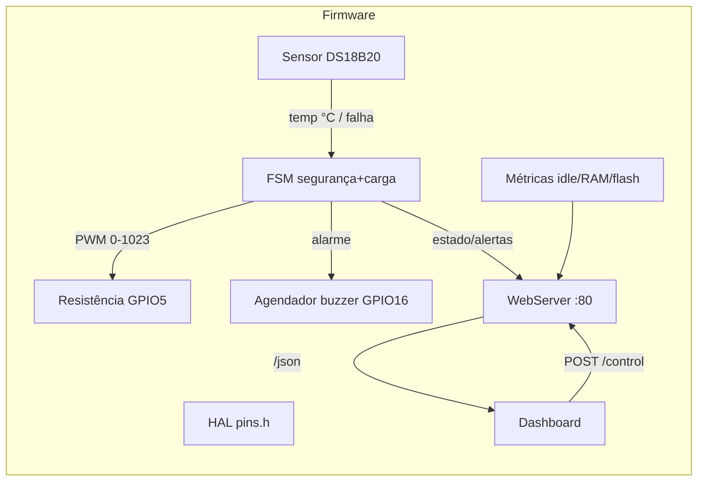

# Design — Controle Térmico ESP8266

> Design da feature (grande/complexa). Arquitetura geral em `codebase/ARCHITECTURE.md`. Requisitos em `spec.md`.

## 1. Visão de módulos e fluxo de dados



## 2. Máquina de estados da FSM

Detalhe em `ARCHITECTURE.md`. Resumo das ações por estado:

| Estado | Carga (PWM) | Buzzer | Dashboard |
| --- | --- | --- | --- |
| `BOOT` | 0 | off | carregando |
| `SCAN_ONEWIRE` | 0 | off | scaneando |
| `SAFE_STOP` | 0 | 300 ms/5 s se falha | estado seguro |
| `MONITORING` | manual (0/1023) | off | normal |
| `HEATER_ON` | 1023 | off | verde |
| `ALARM_TEMP` | 0 (forçado) | 150 ms/2 s | alerta térmico |
| `FAIL_SENSOR` | 0 (forçado) | 300 ms/5 s | alerta de falha |

Regras de transição (resumo): o estado `HEATER_ON` **nunca** persiste sob condição de risco; a saída de `ALARM_TEMP`/`FAIL_SENSOR` retorna a `MONITORING` com carga OFF (`FR-SAF-004`).

## 3. Agendamento não-bloqueante (loop)

Tabela de tarefas agendadas por `millis()` (execução cooperativa, sem `delay()`/ISR):

| Tarefa | Período | Deadline/Jitter |
| --- | --- | --- |
| Leitura DS18B20 | 1,5 s | ±150 ms (`NFR-TIM-001` / D-011) |
| Tick do buzzer | 10 ms | best-effort (ciclos 150/2000 e 300/5000 ms) |
| `server.handleClient()` | a cada iteração | respostas ≤ 100 ms |
| Métricas + idle | 1 s | best-effort |
| Reação de segurança | imediata (pós-leitura) | PWM=0 ≤ 10 ms (`NFR-TIM-002`) |

## 4. Orçamento de memória

- **Flash**: binário ≤ 1.5 MB (meta), limite 4 MB. Dashboard HTML/CSS/JS embutido em PROGMEM (string). Compilado com `pio size` (T-012).
- **RAM**: heap livre ≥ 10 KB. Buffers globais/estáticos:
  - `char json[1024]` (payload `/json`).
  - Janela de tendência: 120 amostras em `int16_t` (temp ×10) → 240 B.
  - Estado da FSM: enum + flags.
- **Sem** `malloc`/`new` no caminho de tempo real (`NFR-MEM-004`).

## 5. Dashboard — design de interface (skill frontend-design)

### 5.1 Direção estética

**"Painel de instrumentação industrial"** — estética de instrumento de bancada: clara, de alto contraste, com tipografia técnica e hierarquia de "leitura rápida" para o operador. Oposição deliberada a dashboards genéricos (sem gradientes roxos, sem cartões flutuantes "candy").

- **Proposito**: leitura instantânea da temperatura e da proximidade do limite de 80 °C; ação de ligar/desligar sem ambiguidade.
- **Tom**: precisão de instrumento — nítido, utilitário, com acentos de segurança (âmbar/vermelho) reservados a risco real.
- **Diferencial memorável**: o **gauge em arco com zona de risco sombreada (70–90 °C)** e o gráfico de tendência **sempre na mesma escala** (20–90 °C), criando percepção imediata de aproximação do limite — sem reescalonamento.

### 5.2 Tipografia

- **Display (títulos, gauge, número grande)**: `Chakra Petch` (webfont Google) — caráter técnico/tecnológico, com terminais angulares que remetem a instrumentação.
- **Corpo/UI (labels, métricas, tooltips)**: `IBM Plex Sans` — leitura limpa e humana.
- Fallback: `ui-monospace, monospace` no gauge (alinhamento estável de dígitos).

### 5.3 Paleta (CSS variables)

```css
:root {
  --bg:        #F4F3EE;   /* papel técnico claro */
  --panel:     #FFFFFF;
  --ink:       #1F2933;   /* carvão, texto principal */
  --ink-soft:  #5B6673;   /* texto secundário */
  --grid:      #D8DAD2;   /* grade cinza claro do gráfico */
  --accent:    #E8730A;   /* âmbar: temperatura/tendência */
  --ok:        #1A7F37;   /* verde: carga ativa */
  --off:       #C5221F;   /* vermelho: carga desligada / risco */
  --risk-bg:   rgba(197,34,31,.08); /* sombra da zona ≥70 °C */
}
```

### 5.4 Layout (sem rolagem em desktop ≥1280×800)

```text
┌────────────────────────────────────────────────────────────┐
│ Cabeçalho: SAEG Térmico · Temp atual · Métricas (idle/RAM/  │
│ flash) + estado (OK | ALARME | FALHA)          [tooltips]   │
├──────────────────────────────┬─────────────────────────────┤
│  Gauge (arco 180°+zona risco)│  Gráfico de tendência        │
│  valor numérico em destaque  │  escala fixa 20–90 °C        │
│                              │  grade cinza + zona ≥70 °C   │
├──────────────────────────────┴─────────────────────────────┤
│  Controle da carga: [ ON ] [ OFF ]  status (verde/vermelho) │
│  tooltip no botão e no status                               │
└─────────────────────────────────────────────────────────────┘
```

- **Grid CSS**: 12 colunas; gauge 5 col, gráfico 7 col; footer de controle em linha única.
- **Responsivo**: abaixo de 900 px empilha (gauge → gráfico → controle), rolagem vertical permitida (mobile).

### 5.5 Componentes e comportamento

- **Gauge**: arco de 180° (escala 20–90 °C), marcações a cada 10 °C, agulha com transição CSS ~200 ms; zona de risco 70–90 °C sombreada em vermelho suave; valor numérico grande em `Chakra Petch`.
- **Gráfico de tendência**: `<canvas>` ou SVG, escala **fixa** (eixo Y 20–90 °C), grade em `--grid`, linha/área na cor `--accent`, janela de 120 pontos (D-003) ≈ 3 min com amostragem de 1,5 s (D-011), sombra da zona ≥70 °C.
- **Botão ON/OFF**: estado claro por cor (`--ok`/`--off`) + texto ("LIGADO"/"DESLIGADO"); quando intertravado (sensor ausente/risco), o botão ON fica **desabilitado visualmente** com tooltip explicando o bloqueio.
- **Métricas**: idle %, heap livre KB, flash ocupada % — no cabeçalho, com tooltips explicando cada uma.
- **Tooltips** (`title`/custom CSS): em todos os controles e visualizações (`FR-UI-006`).
- **Alerta visual**: faixa/badge no cabeçalho — "ALARME TÉRMICO ≥80 °C" (fundo vermelho) vs "FALHA DE SENSOR" (âmbar), além do piscar discreto do gauge em condição crítica.
- **Movimento**: reveal inicial discreto (fade/translate sutil dos painéis); atualização do gauge com transição; sem animações incessantes (tom instrumental, contido).

### 5.6 Restrições normativas atendidas

| Restrição (`docs/descricao.txt` s.5) | Implementação no design |
| --- | --- |
| Tema claro, responsivo, sem rolagem desktop | Paleta clara + grid 12 col + empilhamento mobile |
| Gauge + valor numérico em destaque | Gauge 180° + `Chakra Petch` grande |
| Escala fixa 20–90 °C, grade cinza claro | `--grid` + eixo Y fixo (sem auto-escala) |
| Botão ON/OFF com cores (verde/vermelho) | `--ok`/`--off` + estado desabilitado |
| Métricas de saúde no cabeçalho | idle/RAM/flash no header |
| Tooltips em todos os elementos | `title`/custom tooltip em todos |
| `/json` + polling AJAX | `fetch()` a cada 1 s, in-flight único (`NFR-UI-001`) |

### 5.7 Acessibilidade

- Contraste ≥ AA (texto sobre `--bg`/`--panel`).
- Estados de cor acompanhados de texto/ícone (não só cor).
- `prefers-reduced-motion`: reduz transições.

## 6. Alternativas rejeitadas (design)

- **Escala auto-ajustável do gráfico**: rejeitada (perde percepção de proximidade do limite — requisito normativo).
- **WebSocket para o dashboard**: rejeitado (complexidade no ESP8266; polling 1 s é suficiente e mais simples).
- **Dashboard separado (SPA externo)**: rejeitado (autonomia da rede AP sem infraestrutura — o ESP8266 deve servir tudo).
- **Persistência do estado ON**: rejeitada (sem EEPROM/SPIFFS; fail-safe exige OFF no boot).
