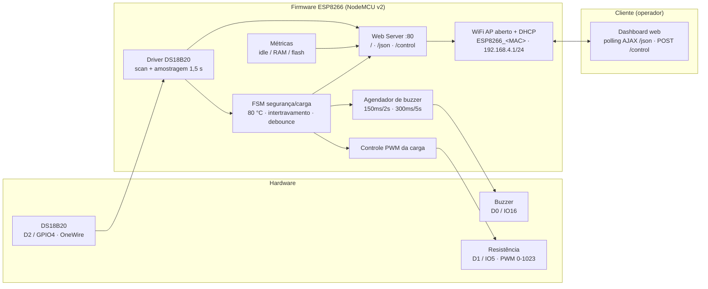

# Sistema de Monitoramento e Controle Térmico ESP8266 (SAEG-2026)

Solução de baixo custo para monitoramento e controle térmico com **ESP8266 (NodeMCU v2)**: sensor **DS18B20**, carga de aquecimento por **PWM (10 bits)**, alarme por **buzzer** e **dashboard web responsivo** servido pelo próprio dispositivo em modo **Access Point** (sem infraestrutura de rede externa).

## Visão geral

- **MCU**: ESP8266EX (NodeMCU v2) @ 3.3 V.
- **Sensores/atuadores**: DS18B20 (OneWire, GPIO4/D2), buzzer (IO16/D0), resistência (PWM, IO5/D1).
- **Rede**: AP aberto `ESP8266_<MAC>` → `http://192.168.4.1` (IP fixo, DHCP ativo).
- **Segurança**: desligamento imediato (PWM=0) se temp ≥ 80 °C ou falha do sensor; intertravamento da carga.
- **Dashboard**: gauge + número, gráfico de tendência (escala fixa 20–90 °C), botão ON/OFF, métricas de saúde (idle/RAM/flash), tooltips, polling AJAX (`/json`).

## Arquitetura



## Especificação

Este projeto segue **desenvolvimento orientado a especificações** (skill `sdd-embarcado`). A especificação vive em `.specs/`:

| Artefato | Conteúdo |
| --- | --- |
| `.specs/project/constitution.md` | Princípios estáveis, segurança, determinismo, recursos |
| `.specs/project/PROJECT.md` | Objetivo, escopo, fontes |
| `.specs/project/ROADMAP.md` | Fases e tarefas |
| `.specs/project/STATE.md` | Estado atual, decisões, bloqueios |
| `.specs/codebase/TARGET.md` | Hardware, pinos, periféricos |
| `.specs/codebase/STACK.md` | Toolchain (PlatformIO + Arduino) |
| `.specs/codebase/ARCHITECTURE.md` | Arquitetura, FSM, memória |
| `.specs/features/controle-termico/spec.md` | Requisitos `FR-###`/`NFR-###` + critérios de aceite `CA-*` |
| `.specs/features/controle-termico/context.md` | Decisões e ambiguidades |
| `.specs/features/controle-termico/design.md` | Design (inclui design do dashboard) |
| `.specs/features/controle-termico/tasks.md` | Quebra em tarefas |

Fonte normativa de intenção: [`docs/descricao.txt`](docs/descricao.txt).

## Compilar

```bash

# Instalar PlatformIO Core (uma vez)

pip install platformio

# Compilar para o alvo (gera src/web/dashboard.h com as fontes embutidas)

pio run -e nodemcuv2
```

## Gravar e monitorar

```bash

# Gravar (ajuste a porta)

pio run -t upload --upload-port /dev/ttyUSB0

# Monitor serial (115200) — não rodar junto com a gravação (lock da porta)

pio device monitor -p /dev/ttyUSB0 -b 115200
```

## Testar

```bash

# Testes HOST da lógica pura (FSM de segurança + agendador do buzzer)

pio test -e native
```

## Usar

1. Conecte-se à rede Wi-Fi `ESP8266_<6 hex do MAC>` (sem senha).
2. Acesse `http://192.168.4.1`.
3. Acompanhe temperatura, métricas e acione a carga pelo botão ON/OFF.

## Endpoints

| Método | Rota | Descrição |
| --- | --- | --- |
| GET | `/` | Dashboard web (HTML/CSS/JS embutido no firmware) |
| GET | `/json` | Payload JSON (temp, estado, PWM, alarme, métricas, tendência 120 pts) |
| POST | `/control?on=1\|0` | Liga/desliga a carga; resposta `{"accepted":...,"on":...}` |

## Status

- **Implementação (Fases 1–3): concluída.** Build do alvo OK (Flash 398.991 B / 38,2%; RAM 29.704 B / 36,3%); testes HOST 10/10 PASS; dashboard validado em navegador (mock).
- **Validação física (HIL): parcial** — firmware gravado no NodeMCU (`/dev/ttyUSB0`), boot estável, AP `ESP8266_807D3A101026` ativo, sensor ausente → `SAFE_STOP` (carga bloqueada). Cenários com sensor/atuação e HTTP via AP pendentes (ver `.specs/features/controle-termico/HANDSOFF.md`).

> Fonte normativa de intenção: [`docs/descricao.txt`](docs/descricao.txt). Especificação completa em `.specs/`.

## Licença

Distribuído sob a **Licença MIT**. Veja o arquivo [`LICENSE`](LICENSE) para os termos completos.

```text
MIT License

Copyright (c) 2026 William Vianna

Permission is hereby granted, free of charge, to any person obtaining a copy
of this software and associated documentation files (the "Software"), to deal
in the Software without restriction, including without limitation the rights
to use, copy, modify, merge, publish, distribute, sublicense, and/or sell
copies of the Software, and to permit persons to whom the Software is
furnished to do so, subject to the following conditions:

The above copyright notice and this permission notice shall be included in all
copies or substantial portions of the Software.

THE SOFTWARE IS PROVIDED "AS IS", WITHOUT WARRANTY OF ANY KIND, EXPRESS OR
IMPLIED, INCLUDING BUT NOT LIMITED TO THE WARRANTIES OF MERCHANTABILITY,
FITNESS FOR A PARTICULAR PURPOSE AND NONINFRINGEMENT. IN NO EVENT SHALL THE
AUTHORS OR COPYRIGHT HOLDERS BE LIABLE FOR ANY CLAIM, DAMAGES OR OTHER
LIABILITY, WHETHER IN AN ACTION OF CONTRACT, TORT OR OTHERWISE, ARISING FROM,
OUT OF OR IN CONNECTION WITH THE SOFTWARE OR THE USE OR OTHER DEALINGS IN THE
SOFTWARE.
```
